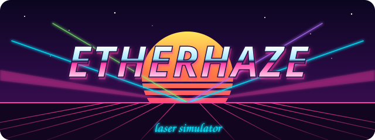

<p align="center"></p>

<p align="center"><b>Émulateur Ether Dream + simulateur de laser RGB dans la fumée.</b><br>
Prépare ton show laser dans TouchDesigner ou MadMapper, sans laser.</p>

> **EN:** Etherhaze pretends to be one or more Ether Dream laser DACs on your network, so TouchDesigner or MadMapper stream to it exactly like to the real hardware. It then simulates what a real RGB laser would do (galvo inertia, color modulation limits, blanking tails, flicker) and renders the beams in haze and smoke in 3D, with live alerts. The UI is in French.

---

## Pourquoi

Un show qui marche sur l'écran peut mal passer sur un vrai laser : buffer du DAC qui déborde, coupures, formes déformées par des galvos trop lents, traînées au blanking, couleurs sombres qui ne s'allument pas… Etherhaze reproduit le **protocole réseau exact de l'Ether Dream** (d'après le firmware open source) et **simule les défauts d'un vrai projecteur**, pour que tu les voies avant le jour J.

## Fonctions

- **Faux Ether Dream sur le réseau** : même protocole TCP, même annonce UDP, même buffer de 1799 points, mêmes refus d'erreur que le vrai boîtier.
- **Plusieurs lasers** (jusqu'à 8), chacun sur son port, avec ses propres réglages et sa position dans la salle.
- **Défauts simulés** : vitesse et réglage des galvos, angle de scan, axes inversés, modulation analogique ou TTL, seuil des diodes, gamma, retard de la couleur, puissances R/G/B (le blanc réel).
- **Rendu 3D** : faisceaux dans la haze et la fumée (densité, taille des nuages, vent, montée, tourbillons), impacts au sol et sur les murs, silhouettes pour l'échelle.
- **Public** : silhouettes 2D à contre-jour (téléphones allumés, bras levés) ou low-poly 3D. Tu peux déposer tes propres PNG détourés dans `public/crowd/`.
- **Vues rapides** (public, scène, dessus, côté, derrière le laser) et mode plein écran (touche H).
- **Vue galvos** : ce que le logiciel envoie comparé à ce que les galvos tracent vraiment.
- **Alertes en direct** : buffer vide ou débordé, point rate trop élevé, formes déformées, sauts allumés (blanking manquant), scintillement (images/s mesurées), couleurs invisibles, **faisceau dans la zone public**.

## Installation

Il faut [Node.js](https://nodejs.org) 18 ou plus récent.

```bash
git clone https://github.com/<ton-compte>/etherhaze.git
cd etherhaze
npm install
npm start
```

Sous Windows, tu peux aussi double-cliquer sur **`start.bat`**. Le visualiseur s'ouvre sur <http://localhost:8080>.

Au premier lancement, Windows demande l'accès réseau pour Node : autorise les **réseaux privés**.

## Brancher TouchDesigner

Un **Laser Device CHOP** par laser :

| Paramètre | Valeur |
|---|---|
| Type | `EtherDream` |
| Network Address | `127.0.0.1` (ou l'IP du PC qui fait tourner Etherhaze) |
| Network Port | `7765` pour le laser 1, `7766` pour le laser 2, etc. |
| Queue Time | `0.05` à 30 000 pps (règle : Queue Time × point rate < 1799) |

Le nombre de lasers se règle avec les boutons **+** et **−** au-dessus des réglages.

**MadMapper** trouve le DAC tout seul, mais uniquement le laser 1 : la découverte automatique utilise le port standard 7765.

## Tester sans logiciel

```bash
npm run test-sender                       # mire propre, laser 1
node tools/test-sender.js --bad           # mire pleine d'erreurs
node tools/test-sender.js --port 7766     # vers le laser 2
```

## Conseils TouchDesigner tirés des tests

- **Queue Time × point rate doit rester sous 1799**, sinon le vrai Ether Dream jette des points et TouchDesigner relance le flux en boucle.
- **TouchDesigner doit tenir ses fps.** Un blocage de plus de ~50 ms vide le buffer et le laser coupe. Pour le show, utilise le mode Perform (F1).
- **Vise 40 à 150 images/s** dans l'alerte de rafraîchissement : en dessous ça scintille, au-dessus les galvos ne suivent plus.
- Les formes en **POP** sont plus légères que les SOP pour un contenu animé.

## Structure

```
server.js           serveur web + gestion des lasers + annonce UDP
lib/dac.js          un Ether Dream émulé (protocole TCP, buffer, lecture)
public/sim.js       simulation d'un projecteur (galvos, couleurs, mesures)
public/app.js       interface, rendu 3D (three.js), alertes
tools/test-sender.js  émetteur Ether Dream de test
```

## Limites

- Le **protocole** est fidèle au firmware open source de l'Ether Dream : ce qui marche ici marchera avec le boîtier. Les modèles les plus récents ont peut-être un buffer plus grand.
- La **physique des galvos et des diodes est une approximation** : les profils sont des ordres de grandeur, pas des modèles précis. Garde quelques minutes au premier branchement réel pour régler le color shift, la taille et l'orientation.
- Le visualiseur consomme du CPU et du GPU. Sur le même PC que TouchDesigner, passe la **Qualité du rendu** sur « Légère » si TouchDesigner perd des fps.
- La détection de **faisceau dans le public** est une aide, pas une étude de sécurité laser.

## Licence

MIT. Voir [LICENSE](LICENSE).

Ether Dream est une marque de ses propriétaires respectifs. Etherhaze est un projet indépendant qui émule le protocole public du DAC.
